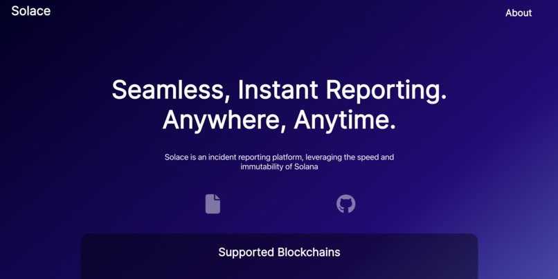
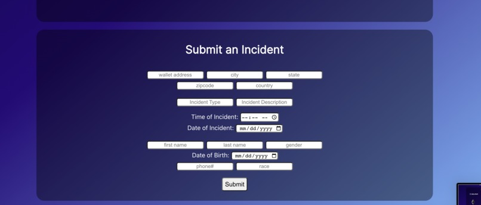

# Solace

**HackTX 2022 Awards:
1st Place - Hedera
Honorable Mention - Binance**

Solace is a decentralized application (dApp) that facilitates incident reports. By leveraging blockchain's transaction finality and scalability, Solace democratizes tamper-proof reporting. Furthermore, Solace's reliance on an immutable peer-to-peer network mandates accountability from all parties involved: namely authoritative figures.

<table>
<tr>
</tr>
<tr>
<td>  </td>
<td>  </td>
</tr></table>

## To Test Solace

Deploy using the following addresses-
 
Solana address (deployed with Neon EVM Devnet) - 0xbDf2234cb45896C2c7FD7375a7075385Ed3886C0
 
Binance address (deployed with Smart Chain Devnet)- 0xfA91A70901DbBF34127Cd1D0Bb2cDeeEF8fb7C2A

## Sample Inputs
**Use the following when deploying Solidity source code, and use these inputs to create a decenentralized report.**

//Sample input for new info function

"Austin", "Texas", "78705", "United States"

//Sample input for new claim function

"Robbery", "Purse stolen from man in grey hoodie", "10:35pm", "10/03/2022", "11:30pm", "10/03/2022"

//Sample input for privInfo function

  "John ", "Doe", "male", "02/23/2001", "(512)893-3334", "caucasian"
